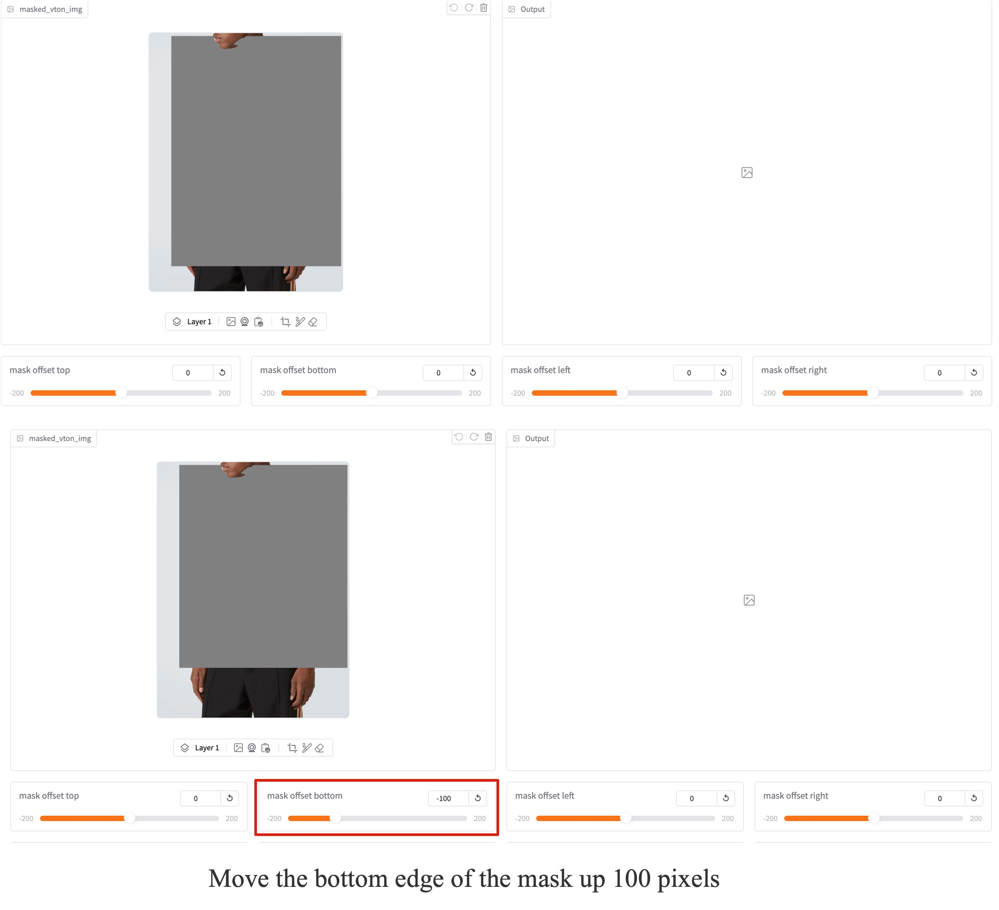
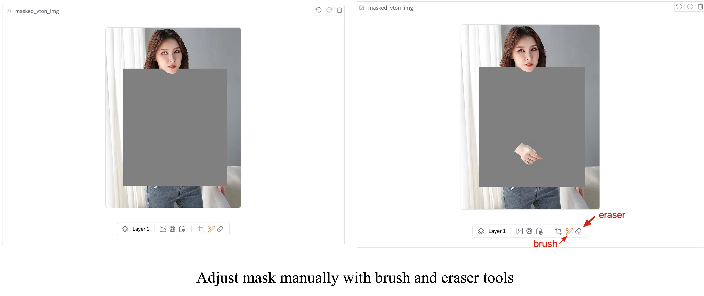

# CV Final Project


## Gradio Demo
Our algorithm is divided into two steps. The first step is to generate the mask of the try-on area, and the second step is to try-on in the mask area.

### Step1: Run Mask
You can simpley get try-on mask by click **Step1: Run Mask** at the right side of gradio demo. If the automatically generated mask are not well covered the area where you want to try-on, you can either adjust the mask by:

1. Drag the slider of *mask offset top*, *mask offset bottom*, *mask offset left* or *mask offset right* and then click **Step1: Run Mask** button, this will re-generate mask.

   

   

2. Using the brush or eraser tool to edit the automatically generated mask

   

### Step2: Run Try-on
After generating a suitable mask, you can get the try-on results by click **Step2: Run Try-on**. In the Try-on resolution drop-down box, you can select a suitable processing resolution. In our online demo, the default resolution is 1152x1536, which means that the input model image and garment image will be pad and resized to this resolution before being fed into the model.


## Local Demo
First apply access of  [model weight](), then unzip and put it into *cv_viton*

### Enviroment
We test our model with following enviroment
```
torch==2.4.0
torchvision==0.19.0
diffusers==0.31.0
transformers==4.39.3
gradio==5.8.0
onnxruntime-gpu==1.20.1
```
### Evaluation pipeline

Configure all required fields in 'application.yaml'
force_run : FID/KID normally require at least 1000 images, but setting this flag to True allows you to override that restriction.
Execute the evaluation service, 'python -m src.service.evaluation_service'
### Run gradio locally
```
# Run model with bf16 without any offload, fastest inference and most memory
python gradio_sd3.py --model_path local_model_dir

# Run model with fp16
python gradio_sd3.py --model_path local_model_dir --fp16

# Run model with fp16 and cpu offload, moderate inference and moderate memory
python gradio_sd3.py --model_path local_model_dir --fp16 --offload

# Run model with fp16 and aggressive cpu offload, slowest inference and less memory
python gradio_sd3.py --model_path local_model_dir --fp16 --aggressive_offload
```

